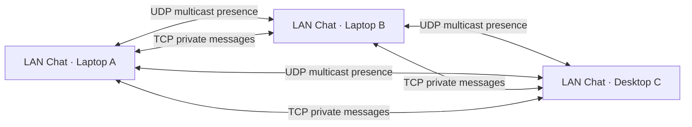

# LAN Chat

A peer-to-peer Java desktop chat application for automatically discovering and
messaging users connected to the same local network using UDP multicast and TCP.

Version **1.0.0** · Java 25 · Windows, macOS and Linux

## Overview and features

LAN Chat discovers other running instances on your Wi-Fi/Ethernet network, without
accounts, internet access, an application server, or external database. Each device
runs its own multicast discovery listener and TCP messaging server.

- Searchable devices, online/offline status, unread counts and previews
- Private text conversations, delivery/read receipts and debounced typing indicators
- Local SQLite history and a stable UUID profile across restarts
- First-run naming, interface selection, notification/sound/IP preferences
- Failed-send retry, offline detection, reconnect and network-interface recovery
- FXML/CSS desktop UI; virtual-thread networking; bounded JSON framing

**Use only on trusted networks. v1 traffic and local history are not encrypted.**
UUID handshakes detect accidental identity mismatch, but do not authenticate a
person or prevent impersonation by another LAN participant.

## Screenshots

Run the optional GUI smoke test to produce `target/ui-smoke.png`.
Release screenshots of two physical devices are a manual release checklist item.

## Requirements and technology

- JDK 25 and Maven 3.9+ to develop/build
- JavaFX 25.0.2, Jackson 2.21.3, SLF4J 2.0.17 / Logback 1.5.29
- SQLite JDBC 3.53.1.0, JUnit Jupiter 5.14.2, Mockito 5.21.0
- A graphical desktop and a network that permits multicast and peer TCP

The first Maven build downloads dependencies. Running the built application does
not require internet access. Installers include a runtime so end users need no JDK.
Dependencies are pinned, not automatically upgraded. Review updates before release.

## Build and run

```sh
mvn clean compile
mvn test
mvn clean package
mvn javafx:run
```

Or, after packaging:

```sh
java --enable-native-access=ALL-UNNAMED -jar target/lan-chat-1.0.0.jar
```

Keep `target/lib` beside the JAR. On first launch, enter a display name. Open the
app on a second device, select it in the sidebar, and type a message. Enter sends;
Shift+Enter inserts a newline. Settings are saved locally and interface changes
take effect on the next heartbeat. Closing the window exits the app, not just the UI.

## IntelliJ IDEA run configurations

Open/import `pom.xml` as a Maven project, let Maven dependencies sync, and set
Project SDK and the `lan-chat` module SDK to **JDK 25** in Project Structure.
Shared configurations live in `.run/` and use the project SDK:

- **LAN Chat** — normal profile in the platform application-data directory.
- **LAN Chat - Alice** — isolated profile/history in `.runtime/alice`.
- **LAN Chat - Bob** — isolated profile/history in `.runtime/bob`.
- **LAN Chat - Two Peers** — starts Alice and Bob together.

Select a configuration in the Run widget and use Run or Debug. Each application
configuration builds before launching `com.lanchat.Launcher` with
`--enable-native-access=ALL-UNNAMED`. No separate JavaFX SDK or manual module path
is needed: JavaFX comes from Maven dependencies. Use `Launcher`, not
`LanChatApplication`, as the entry point for these classpath configurations.

Alice and Bob are configuration labels, not pre-created profiles; enter the names
at first launch. Their data directories are git-ignored. Do not start the same
profile twice. A multicast-capable local network is needed for peer discovery.

If IDEA imported a differently named module, open Run → Edit Configurations and
set **Use classpath of module** to the module containing `src/main/java`. If the
shared configurations do not appear immediately, reopen the project. These files
are provided for IDEA; the IDE itself is not exercised by the Maven test suite.

## Architecture



UDP carries **only discovery**. TCP carries actual chat traffic. A stable UUID
identifies peers; IP addresses are routing information and may change with DHCP.
JavaFX owns UI state; serialized background work handles profile/database actions;
virtual threads handle socket I/O. SQLite access is serialized. UI updates use
`Platform.runLater`. A shutdown worker closes discovery, sockets, executors and data.

### Discovery

Every 3 seconds, advertise `DISCOVERY`, app `LAN_CHAT`, protocol `1.0`, UUID,
display name, device name, chat port and timestamp to `239.255.42.99:45678` with TTL 1.
The datagram's **source address** is used, never an advertised address. Last-seen
time uses the receiver's clock; peers go offline after 10 seconds (up to one extra
3-second sweep interval). The registry ignores self and deduplicates by UUID.

Active IPv4, non-loopback multicast interfaces are candidates. Common virtual,
VPN, Docker and Apple peer-to-peer interfaces are excluded. Automatic chooses the
first candidate by interface name; Settings can pin an interface. The heartbeat
rechecks the address/interface and re-joins after changes. There is no LAN scanning.

### TCP and message protocol

The server tries port 45679, falling back to an OS-assigned port if occupied.
The actual selected port is advertised. Connections have a 3-second connect/HELLO
timeout, bounded writes, keepalive PING/PONG and a 90-second idle read timeout.
Simultaneous connections converge on the one initiated by the lower UUID.

Frames are a big-endian 4-byte positive length followed by that many UTF-8 JSON
bytes. Maximum frame: 65,536 bytes. Maximum text: 10,240 UTF-8 bytes. The receiver
uses `readFully`, rejects oversized lengths before allocation, limits nesting,
rejects duplicate JSON fields, and never uses Java object deserialization.

Both sides first send:

```json
{"type":"HELLO","protocolVersion":"1.0","deviceId":"550e8400-e29b-41d4-a716-446655440000","displayName":"Alice","timestamp":1787959800000}
```

Subsequent events use `type`, `protocolVersion`, `messageId`, `senderId`,
`receiverId`, `timestamp` and optional `content`. Sender/recipient must match the
session. Receipt `messageId` is the original chat ID. All IDs are canonical UUIDs.
Types: `CHAT_MESSAGE`, `DELIVERY_ACK`, `READ_ACK`, `TYPING_START`, `TYPING_STOP`,
`PING`, `PONG`, `DISCONNECT`. Unknown types/versions and malformed sessions close.

Messages are persisted **before** delivery acknowledgement. Duplicate chat IDs
do not duplicate history. ACK updates include both peer IDs and cannot regress
READ to SENT. SENT means written to the socket, DELIVERED means stored by the
remote app, and READ means its conversation was focused. A failed send can be
retried using the same ID; there is no automatic offline outbox. Typing events
are debounced, expire after inactivity, and are never persisted.

## Project structure

```text
src/main/java/com/lanchat/
  config/       configuration and platform data directories
  controller/   JavaFX main, chat and settings controllers
  discovery/    registry, multicast listener/broadcaster, interface recovery
  messaging/    framing, TCP client/server, sessions, receipts
  model/        immutable records and enums
  repository/   SQLite persistence
  security/     isolated future encryption primitives
  service/      profile, lifecycle and optional desktop notifications
  util/         JSON and interface utilities
  validation/   network input validation
src/main/resources/  FXML, CSS, application.properties, Logback
src/test/java/       unit, loopback integration and opt-in GUI tests
scripts/             native packaging
```

## Local data

Windows: `%APPDATA%/LANChat/` · macOS: `~/Library/Application Support/LANChat/` ·
Linux: `$XDG_DATA_HOME/lanchat/` (default `~/.local/share/lanchat/`).

Override with `LANCHAT_DATA_DIR` or Java property `lanchat.dataDir`. Each directory
contains a profile, process lock and SQLite database. Never share it between live
instances. The lock prevents accidental reuse of one identity/database. History
uses prepared statements, an indexed conversation query and WAL mode. Chat
history clearing requires confirmation; it is logical deletion, not forensic
erasure. Back up the directory only after closing the app.

## Testing two local instances

In separate terminals (macOS/Linux):

```sh
LANCHAT_DATA_DIR="$PWD/.runtime/alice" mvn javafx:run
LANCHAT_DATA_DIR="$PWD/.runtime/bob" mvn javafx:run
```

PowerShell, one terminal per instance:

```powershell
$env:LANCHAT_DATA_DIR="$PWD/.runtime/alice"
mvn javafx:run
```

Use `bob` in the other terminal. The second TCP server automatically gets another
port. A multicast-capable Wi-Fi/Ethernet interface is still required. Some OS/network
configurations do not deliver local multicast loopback to both processes; use two
physical devices if local discovery fails. Automated TCP tests use loopback directly.

## Tests and acceptance checks

`mvn test` exercises framing, malformed JSON, registry expiry, Unicode size limits,
profile locks, SQLite persistence/statuses, serialization, crypto primitives and
real loopback HELLO/chat/receipt exchange. No external server is required.

Optional desktop test (opens a temporary JavaFX window):

```sh
mvn -Dlanchat.guiTest=true -Dtest=JavaFxSmokeTest test
```

Optional actual LAN multicast test (advertises two temporary test profiles):

```sh
mvn -Dlanchat.networkTest=true -Dtest=MulticastIntegrationTest test
```

Before release, test on two physical computers:

1. Connect both to the same trusted network and allow local network permissions.
2. Start with different profiles; verify automatic discovery without entering IPs.
3. Send both ways; verify typing, delivery, focus-dependent read receipts and unread badges.
4. Close one peer; verify offline status after roughly 10–13 seconds. Restart it.
5. Restart both; confirm profile identities and history survive.
6. Disconnect/reconnect Wi-Fi; verify the UI remains responsive and discovery resumes.
7. Disable notifications and verify messages still arrive. Clear history only after confirmation.
8. Test Windows/macOS/Linux packages and repeated shutdown/startup.

## Firewall and troubleshooting

Allow inbound UDP **45678** and inbound TCP for the application on **private/local**
networks. TCP is normally **45679**, but may be dynamically assigned; Settings shows
the actual port. Allow the application rather than only one port when using multiple
instances. On macOS, also grant Local Network permission when requested.

- No devices: both must run LAN Chat, share a reachable LAN, and permit multicast.
- Guest Wi-Fi/client isolation can prohibit all peer traffic; use a non-isolated network.
- VPNs can alter routing. Select Wi-Fi/Ethernet explicitly in Settings.
- A pinned interface that disappears shows network unavailable; choose Automatic.
- Failed messages: check the peer is online and its firewall permits the advertised TCP port.
- Profile in use: close the other instance or choose a separate data directory.
- SQLite/native-access errors: use the supplied JDK flags and a supported OS/architecture.
- Native notifications depend on SystemTray/OS support; unread badges/title remain available.

## Security and known limitations

- **No encryption or authenticated pairing in v1.** Do not send passwords or sensitive data.
  X25519 and AES-GCM helpers are tested but deliberately not connected to messaging.
- Discovery advertises only names, UUID and port; it is not a general network scanner.
- Handshake identities can be impersonated. Limits (64 inbound sessions, 1,024 peers,
  4-KB discovery packets, bounded frames) reduce resource abuse, not eliminate LAN DoS.
- Network payloads/message content are not logged at INFO. Invalid packets are DEBUG.
- IPv4 discovery on one selected interface; no cross-subnet discovery, NAT traversal,
  multicast fallback, file transfers, group chat, or automatic offline delivery.
- The conversation view loads the latest 500 messages; all messages remain in SQLite.
  Older-history paging/export is future work. Unread counts cover the full history.
- Read receipts describe opening a conversation, not proof that a person read every word.
- Native notifications/sounds are best effort, especially on macOS and Linux desktops.
- Physical-device testing, signed/notarized installers and OS-matrix CI execution are
  release gates; a successful local build alone does not establish production readiness.

## Packaging

Build **on each target OS/architecture**; jpackage does not cross-compile installers.
Scripts bundle dependencies and ask jpackage to generate a Java 25 runtime image.

```sh
sh scripts/package.sh app-image  # macOS/Linux portable app
sh scripts/package.sh dmg        # macOS installer
sh scripts/package.sh deb        # Debian/Ubuntu installer (requires native packaging tools)
```

```powershell
./scripts/package.ps1 app-image
./scripts/package.ps1 exe
./scripts/package.ps1 msi
```

Install the native packaging prerequisites for your JDK/OS (for example WiX on
Windows and Debian tools on Linux). Output is under `dist/`; move an existing
same-named output before packaging again. Sign/notarize distribution builds with
your own credentials; no keys are stored in this repository. Default jpackage icons
are used until final brand assets are supplied.

## Roadmap

Authenticated pairing and encrypted sessions, paginated history/export, accessibility
and keyboard-navigation polish, signed installers, discovery fallback, group chat,
attachments, replies/reactions and optional themes.

## Contributing and license

Use focused changes with tests. Keep network and disk I/O off the JavaFX thread;
do not log private chat content or add cloud dependencies. Run `mvn clean package`
before submitting. CI is configured for Java 25 on Windows, macOS and Linux.

MIT; see [LICENSE](LICENSE). Dependency licenses remain their respective owners'.
